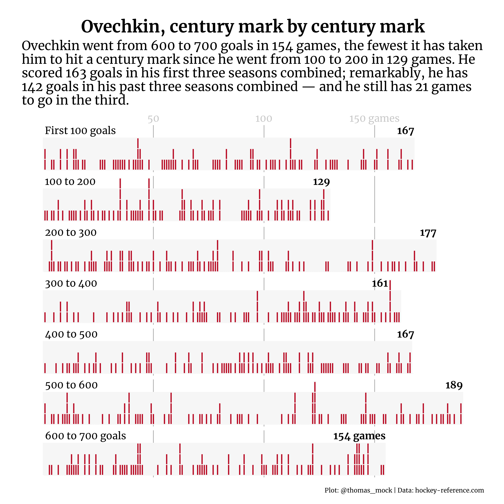

# NHL Goals

My overall goal was to recreate the core plot from the Washington Post. I really enjoy the process of recreating things in R.



Code:

```{r}

# Load Libraries ----------------------------------------------------------

library(tidyverse)

# Read in Data ------------------------------------------------------------

top_game_logs <- read_rds(here::here("data", "top_game_logs.rds"))

# Add "century" marks -----------------------------------------------------

ove_sum <- top_game_logs %>%
  filter(player == "Alex Ovechkin") %>%
  mutate(run_goals = cumsum(goals)) %>%
  select(-starts_with("assists"), -rank, -at, -penalty_min) %>%
  select(player:goals, run_goals) %>%
  mutate(
    goal_range = case_when(
      run_goals <= 100 ~ "First 100 goals",
      # Between gives bookends to the factor to assign "century marks
      between(run_goals, 101, 200) ~ "100 to 200",
      between(run_goals, 201, 300) ~ "200 to 300",
      between(run_goals, 301, 400) ~ "300 to 400",
      between(run_goals, 401, 500) ~ "400 to 500",
      between(run_goals, 501, 600) ~ "500 to 600",
      between(run_goals, 601, 700) ~ "600 to 700 goals",
      TRUE ~ NA_character_
    ),
    # Make 100 the first level of factor
    goal_range = fct_relevel(goal_range, "First 100 goals")
  ) %>%
  # exclude goal 701
  filter(!is.na(goal_range))


# Correct missing portions ------------------------------------------------

ove_plot_df <- ove_sum %>%
  mutate(goal_range = as.character(goal_range)) %>%
  # There are cases where Ovechkin scored a "century" and then had game droughts
  # We can create logic to assign correct factor label
  mutate(goal_range = case_when(
    run_goals == 200 & date >= as.Date("2009-02-07") ~ "200 to 300",
    run_goals == 501 & date == as.Date("2016-01-10") ~ "500 to 600",
    run_goals == 600 & date >= as.Date("2018-03-15") ~ "600 to 700 goals",
    TRUE ~ goal_range
  )) %>%
  # add in a "fake" game to make the multi-goal game align
  add_row(
    season = 2016, date = as.Date("2016-01-10"),
    goals = 0, run_goals = 500, goal_range = "400 to 500",
    .before = 801
  ) %>%
  # Make sure that factors still exist
  mutate(goal_range = fct_relevel(goal_range, "First 100 goals")) %>%
  # Now we need to add the rolling game count (g_roll) within each "century"
  group_by(goal_range) %>%
  mutate(
    g_roll = row_number(),
    g_roll = if_else(run_goals == 600 & date == as.Date("2018-03-12"),
      189L, g_roll
    )
  ) %>%
  select(season, date, goals, run_goals, goal_range, g_roll) %>%
  ungroup() %>%
  # Exclude game with 0 goals after his 700th
  filter(!(run_goals == 700 & g_roll == 155))


# Add dataset for the background ribbon -----------------------------------
# This is a gray background 3 goals high and as wide as the number of games
# For each century count get the highest g_roll

rect_df <- ove_plot_df %>%
  filter(goals >= 1) %>%
  group_by(goal_range) %>%
  top_n(1, g_roll) %>%
  # add one to to give a bit of padding on end
  mutate(xmin = 0, ymin = 0, ymax = 3, xmax = g_roll + 1) %>%
  ungroup() %>%
  select(xmin:xmax, goal_range)


# Add dataset for horizontal line that breaks columns into rectang --------
# segment_df is a horiz line at 1

segment_df <- ove_plot_df %>%
  filter(goals >= 1) %>%
  group_by(goal_range) %>%
  top_n(1, g_roll) %>%
  mutate(x = 0, y = 1, yend = 1, xend = g_roll + 1) %>%
  ungroup() %>%
  select(x:xend, goal_range)

# add in a line at 2 and 3 as well
seg_df <- segment_df %>%
  bind_rows(
    segment_df %>% mutate(y = 2, yend = 2),
    segment_df %>% mutate(y = 3, yend = 3)
  )

# Confirm that the changes made align with actual results
# Should be [1] 167 129 177 161 167 189 189 154 games
# 189 is duplicated due to the "fake game" we introduced
ove_plot_df %>%
  group_by(goal_range) %>%
  top_n(1, g_roll) %>%
  ungroup()


# Add game labels via dataset ---------------------------------------------

game_label_df <- ove_plot_df %>%
  group_by(goal_range) %>%
  slice(n()) %>%
  ungroup() %>%
  mutate(
    g_label = c(rep("", 6), " games"),
    g_label = str_c(g_roll, g_label),
    g_roll = if_else(goal_range == "300 to 400", g_roll - 6L, g_roll)
  )


# Plot everything ---------------------------------------------------------

(ove_goals_plot <- ove_plot_df %>%
  ggplot(aes(x = g_roll, y = goals)) +
  # add overall label for 50, 100 and 150 games across facets
  geom_vline(xintercept = c(50, 100, 150), color = "grey") +
  # add a gray background within each facet
  geom_rect(
    data = rect_df, inherit.aes = FALSE,
    aes(xmin = xmin, xmax = xmax, ymin = ymin, ymax = ymax),
    fill = "#F8F8F8"
  ) +
  # add the actual data points (a column)
  # will need to separate with a horiz line via geom_segment below
  geom_col(color = "#F8F8F8", fill = "#C7212F") +
  # add a line that "breaks" the col into sections
  geom_segment(
    data = seg_df, inherit.aes = FALSE,
    aes(x = x, xend = xend, y = y, yend = yend),
    color = "#F8F8F8"
  ) +
  # add number of game_labels to end of gray strip
  geom_text(
    data = game_label_df,
    aes(x = g_roll + 1, y = 4, label = g_label),
    hjust = 1, vjust = 0.9, size = 5, fontface = "bold", family = "Merriweather Bold"
  ) +
  # add goal range to START of each facet
  geom_text(
    data = distinct(ove_plot_df, goal_range),
    aes(x = 1, y = 4, label = goal_range),
    hjust = 0, vjust = 0.9, size = 5, family = "Merriweather Regular"
  ) +
  # facet by each century (100 goals)
  facet_wrap(~goal_range, ncol = 1) +
  # add title and subtitle that matches Washington Post article/graphic
  labs(
    title = "Ovechkin, century mark by century mark",
    subtitle = "Ovechkin went from 600 to 700 goals in 154 games, the fewest it has taken\nhim to hit a century mark since he went from 100 to 200 in 129 games. He\nscored 163 goals in his first three seasons combined; remarkably, he has\n142 goals in his past three seasons combined — and he still has 21 games\nto go in the third.",
    caption = "\nPlot: @thomas_mock | Data: hockey-reference.com"
  ) +
  theme_minimal() +
  # add label at top for each breakpoint
  scale_x_continuous(
    position = "top",
    breaks = c(50, 100, 150),
    labels = c("50", "100", "150 games")
  ) +
  # turn clip off to prevent any clipping of custom text
  coord_cartesian(clip = "off") +
  # adjustments to remove grid lines, axis text, and facet labels
  # Adjust size and font
  theme(
    text = element_text(family = "Merriweather Regular"),
    axis.text.y = element_blank(),
    plot.title = element_text(face = "bold", size = 24, hjust = 0.5, family = "Merriweather Bold"),
    plot.subtitle = element_text(size = 18, "Merriweather Regular"),
    axis.text.x = element_text(vjust = 1, color = "lightgrey", size = 14),
    axis.title = element_blank(),
    panel.grid.minor = element_blank(),
    panel.grid = element_blank(),
    strip.text = element_blank(),
    strip.placement = "inside",
    plot.margin = unit(c(1, 1, 0.5, 1), "cm")
  )
)

# Save the plot!
ggsave("ove_plot.png", ove_goals_plot, height = 10, width = 10, units = "in", dpi = "retina")


# alternative with Tile ---------------------------------------------------

(ove_goals_plot <- ove_plot_df %>% 
   # uncount the data
   select(date, goals, goal_range, g_roll) %>% 
   uncount(goals) %>% 
   group_by(date, goal_range) %>% 
   # Subtract 0.5 as geom_tile() centers around the data point
   mutate(goals = row_number() - 0.5) %>% 
   ungroup() %>% 
   ggplot(aes(x = g_roll, y = goals)) +
   # add overall label for 50, 100 and 150 games across facets
   geom_vline(xintercept = c(50, 100, 150), color = "grey") +
   # add a gray background within each facet
   geom_rect(
     data = rect_df, inherit.aes = FALSE,
     aes(xmin = xmin, xmax = xmax, ymin = ymin, ymax = ymax),
     fill = "#F8F8F8"
   ) +
   # add the actual data points tiled by game_num
   geom_tile(width = 0.5, height = 0.9, fill = "#C7212F") +
   geom_text(
     data = game_label_df,
     aes(x = g_roll + 1, y = 4, label = g_label),
     hjust = 1, vjust = 0.9, size = 5, fontface = "bold", family = "Merriweather Bold"
   ) +
   # add goal range to START of each facet
   geom_text(
     data = distinct(ove_plot_df, goal_range),
     aes(x = 1, y = 4, label = goal_range),
     hjust = 0, vjust = 0.9, size = 5, family = "Merriweather Regular"
   ) +
   # facet by each century (100 goals)
   facet_wrap(~goal_range, ncol = 1) +
   # add title and subtitle that matches Washington Post article/graphic
   labs(
     title = "Ovechkin, century mark by century mark",
     subtitle = "Ovechkin went from 600 to 700 goals in 154 games, the fewest it has taken\nhim to hit a century mark since he went from 100 to 200 in 129 games. He\nscored 163 goals in his first three seasons combined; remarkably, he has\n142 goals in his past three seasons combined — and he still has 21 games\nto go in the third.",
     caption = "\nPlot: @thomas_mock | Data: hockey-reference.com"
   ) +
   theme_minimal() +
   # add label at top for each breakpoint
   scale_x_continuous(
     position = "top",
     breaks = c(50, 100, 150),
     labels = c("50", "100", "150 games")
   ) +
   scale_y_continuous(limits = c(0,4)) +
   # turn clip off to prevent any clipping of custom text
   coord_cartesian(clip = "off") +
   # adjustments to remove grid lines, axis text, and facet labels
   # Adjust size and font
   theme(
     text = element_text(family = "Merriweather Regular"),
     axis.text.y = element_blank(),
     plot.title = element_text(face = "bold", size = 24, hjust = 0.5, family = "Merriweather Bold"),
     plot.subtitle = element_text(size = 18, "Merriweather Regular"),
     axis.text.x = element_text(vjust = 1, color = "lightgrey", size = 14),
     axis.title = element_blank(),
     panel.grid.minor = element_blank(),
     panel.grid = element_blank(),
     strip.text = element_blank(),
     strip.placement = "inside",
     plot.margin = unit(c(1, 1, 0.5, 1), "cm")
   )
)

ggsave("ove_plot_tile.png", ove_goals_plot, height = 10, width = 10, units = "in", dpi = "retina")

```
