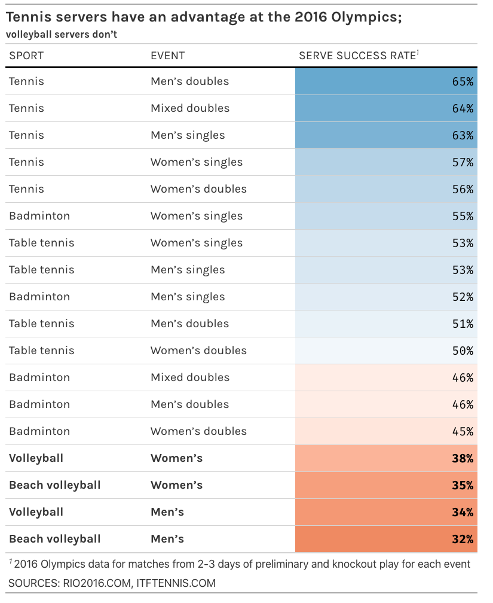

# Quick TidyTuesday

I decided to recreate the table from [FiveThirtyEight](https://fivethirtyeight.com/features/serving-is-a-disadvantage-in-some-olympic-sports/) with some minor editorial decisions.



```{r}
library(tidyverse)
library(rvest)
library(gt)
library(scales)

serve_df <- "https://fivethirtyeight.com/features/serving-is-a-disadvantage-in-some-olympic-sports/" %>% 
  read_html() %>% 
  html_table() %>% 
  .[[1]] %>% 
  mutate(`SERVE SUCCESS RATE` = str_remove(`SERVE SUCCESS RATE`, "%") %>% as.integer())


serve_colors <- rev(c("#cce6cd", "#edf6ed", "white", "#fceae8", "#fcbfb5"))

cb_colors <- c("#ef8a62", "white", "#67a9cf")

serve_scale_color <- scales::col_numeric(serve_colors, 
                                         domain = c(min(serve_df$`SERVE SUCCESS RATE`),
                                                    max(serve_df$`SERVE SUCCESS RATE`)))

serve_scale_cb <- scales::col_numeric(cb_colors, 
                                         domain = c(min(serve_df$`SERVE SUCCESS RATE`),
                                                    max(serve_df$`SERVE SUCCESS RATE`)))
serve_scale_cb(60) %>% show_col()

serve_df %>% 
  gt() %>% 
  data_color(
    columns = vars(`SERVE SUCCESS RATE`),
    colors = serve_scale_cb
  ) %>%
  gt::fmt(
    columns = vars(`SERVE SUCCESS RATE`),
    rows = 1,
    fns = function(x){
      paste0(x,"%")
    }
  ) %>% 
  tab_header(
    title = md("**Tennis servers have an advantage at the 2016 Olympics;**"),
    subtitle = md("**volleyball servers don’t**")
    ) %>% 
  tab_source_note("SOURCES: RIO2016.COM, ITFTENNIS.COM") %>% 
  tab_footnote(footnote = "2016 Olympics data for matches from 2-3 days of preliminary and knockout play for each event",
               locations = cells_column_labels(
                 columns = vars(`SERVE SUCCESS RATE`)
               )) %>% 
  tab_style(
    style = list(
      cell_text(font = "Karla",
                align = "left")
      
    ),
    locations = list(
      cells_body(gt::everything()),
      cells_column_labels(gt::everything()),
      cells_title(groups = "title"),
      cells_title(groups = "subtitle")
    )
  ) %>% 
  tab_style(
    style = list(
      cell_text(font = "Fira Mono", align = "right")
    ),
    locations = list(
      cells_body(vars(`SERVE SUCCESS RATE`))
    )
  )  %>% 
    tab_style(
      style = cell_borders(
        side = "bottom", color = "black", weight = px(3)
      ),
      locations = cells_column_labels(gt::everything())
    ) %>% 
  tab_style(
    style = cell_text(
      weight = "bold",
      
    ),
    locations = cells_body(
      columns = gt::everything(),
      rows = str_detect(tolower(SPORT), "volleyball")
    )
  )
  


```
